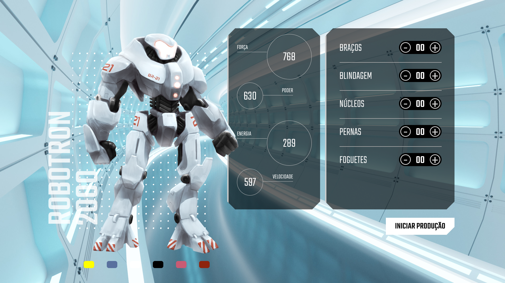

# robotron-2000

Projeto de estudo e prática javascript front-end do curso "Javascript: manipulando o DOM" da [Alura](https://alura.com.br).

  Consiste em uma tela onde se pode manipular o status de um robô adicionando ou removendo <i>features</i> dele.

  
